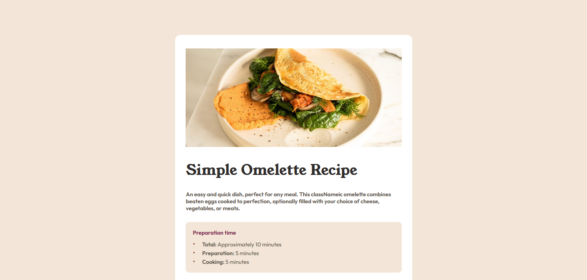

#  Página de receta

Está página es un reto que he sacado de [Frontend Mentor](https://www.frontendmentor.io), la cual consiste en mostrar un diseño responsive sobre la preparación de un Omelette

# Capturas de pantalla
  ## Desktop
  
  
  ## Mobile
  

# Demo

- Puedes ver una **Demo** en vivo [presionando aquí](https://juanblancodev.github.io/recipe-page/)

# Clonar el proyecto
Si deseas trabajar en este proyecto de forma local, puedes seguir estos pasos para clonarlo en tu PC:

1. Abre tu términal si estás en `Linux/Mac` o el CMD si estás en `Windows`
2. Navega hacia la carpeta en donde quieres clonar el proyecto
3. Copia el enlace del repositorio haciendo clic en el botón "Code" en GitHub y luego copiando la URL que se muestra
4. Usa el comando `git clone` y coloca la URL que copiaste como parámetro
   ```sh
   git clone https://github.com/JuanBlancodev/recipe-page.git
   ```
5. Presiona **Enter** para ejecutar el comando y espera que el proyecto se clone por completo
6. Navega hacia la carpeta del proyecto clonado
   ```sh
   cd recipe-page
   ```
7. Instala las dependencias del proyecto con tu manejador de paquetes
   ```bash
   npm install
   ```
   o
   ```bash
   yarn install
   ```
8. Ahora puedes trabajar en el proyecto de manera local

## Tecnologías utilizadas

<ul style="list-style:none; display: flex; gap: 15px;font-weight: bold;">
  <li style="display: flex; align-items: center; gap: 5px;">
    
    <a href="https://html.spec.whatwg.org/" target="_blank">HTML</a>
  </li>
  <li style="display: flex; align-items: center; gap: 5px;">
    
    <a href="https://www.w3.org/Style/CSS/" target="_blank">CSS</a>
  </li>
  <li style="display: flex; align-items: center; gap: 5px;">
    
    <a href="https://es.react.dev/" target="_blank">React</a>
  </li>
  <li style="display: flex; align-items: center; gap: 5px;">
    
    <a href="https://yarnpkg.com/" target="_blank">Yarn</a>
  </li>
  <li style="display: flex; align-items: center; gap: 5px;">
    
    <a href="https://vitejs.dev/" target="_blank">Vite</a>
  </li>
</ul>

## Créditos

- **Autor:** [JuanBlancodev](https://github.com/JuanBlancodev)<br>
- **Repositorios en github:** [Ver](https://github.com/JuanBlancodev?tab=repositories)